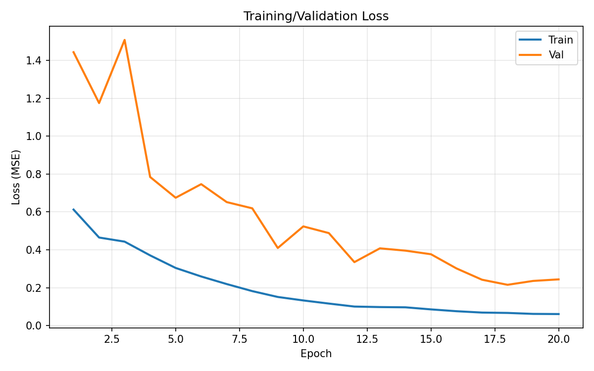
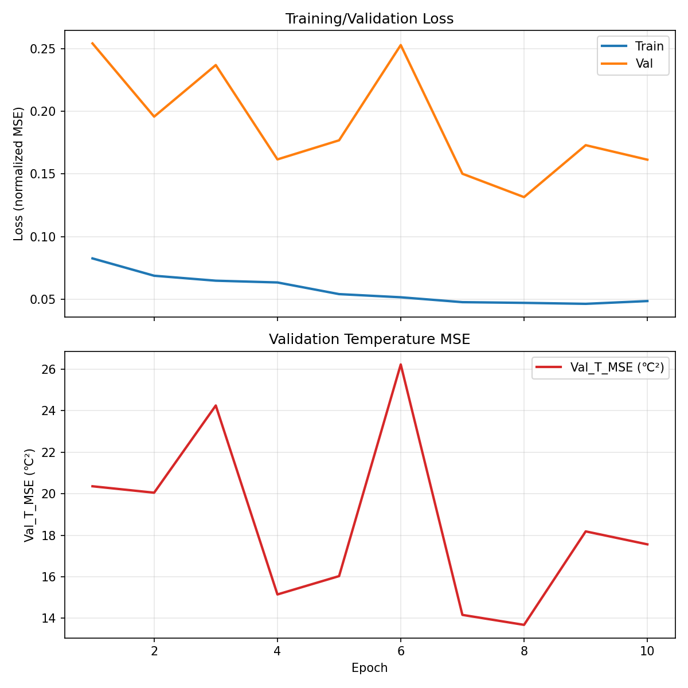
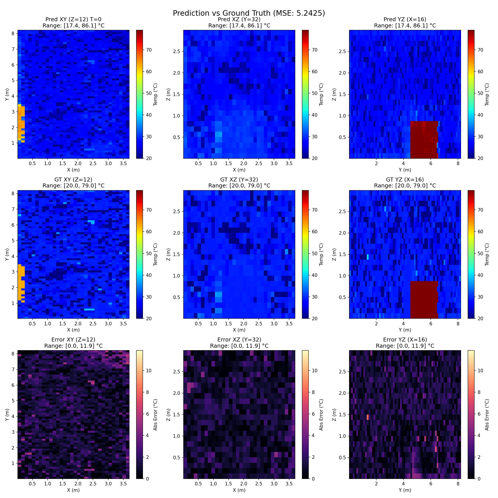
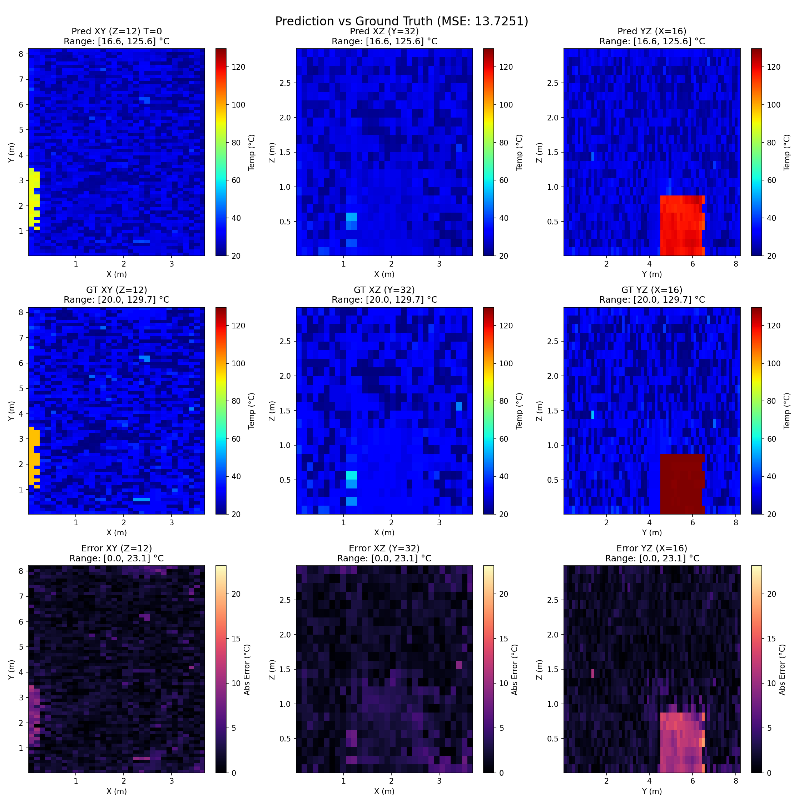
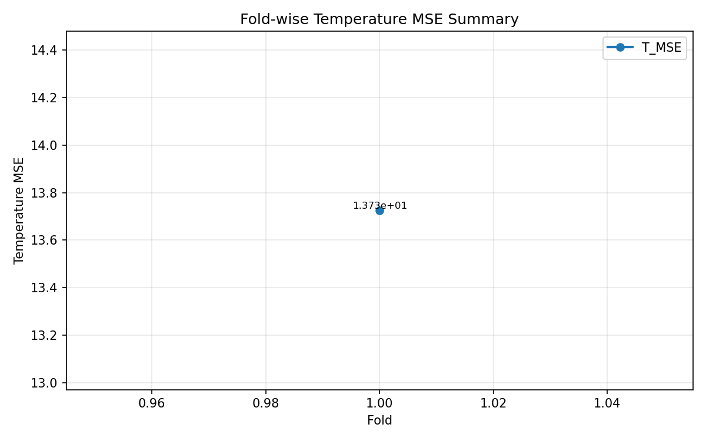

## 二、第四部分 主要研究结果

本部分可直接作为报告中“第四部分 主要研究结果”的主体内容使用。写法上采用“定量结果 + 训练过程 + 可视化结果 + 结果分析”的组织方式，使结论不仅来自数值表格，也来自图像与过程证据。

### 2.1 研究结果总体概述

本项目已经完成从 CFD 原始数据预处理、三维训练样本构建、神经网络训练、批量推理到结果可视化的完整流程。当前阶段的主要结果可概括为以下几点：

1. 成功建立了实验室三维热流场的深度学习代理建模流程。
2. 模型已能够输出 6 个物理量的联合预测结果，而不仅仅是温度。
3. 在当前两折实验中，模型对温度场的主要分布规律已经具备较好的学习能力。
4. 训练过程整体收敛稳定，说明当前数据组织和网络结构设计是有效的。
5. 从预测可视化结果看，模型对主导温度分布区域和整体梯度趋势能够较好复现，但在复杂工况下仍存在误差增大的情况。

### 2.2 定量结果分析

#### 2.2.1 温度通道核心指标

当前两折实验的温度预测结果如下表所示。

| 实验折次 | T_MSE (℃²) | T_RMSE (℃) | T_MAE (℃) |
|---|---:|---:|---:|
| fold_0 | 5.242461 | 2.289642 | 1.631136 |
| fold_1 | 13.725123 | 3.704743 | 2.300975 |

由上表可以看出，模型在 `fold_0` 上取得了较好的温度预测效果，均方根误差约为 2.29℃；在 `fold_1` 上误差增大，说明随着验证区间和控制段复杂度变化，模型泛化难度上升。但从整体趋势上看，模型已经能够有效学习实验室热环境的主要空间分布规律。

#### 2.2.2 多物理量联合预测指标

除温度外，模型还输出 `U/V/W/K/NUT` 五类流场相关物理量。当前活动折的指标如下。

| 物理量 | MSE | RMSE | MAE |
|---|---:|---:|---:|
| T | 13.725123 | 3.704743 | 2.300975 |
| U | 0.029964 | 0.173102 | 0.108315 |
| V | 0.089034 | 0.298385 | 0.191315 |
| W | 0.154779 | 0.393419 | 0.249354 |
| K | 0.000776 | 0.027856 | 0.017624 |
| NUT | 0.000008 | 0.002756 | 0.001700 |

这些结果表明，本项目的网络并不是只对温度做单独拟合，而是已经在一定程度上学习到了温度场与流动场之间的耦合关系。尤其是 `K` 和 `NUT` 的误差较低，说明模型对部分湍流相关量具有较稳定的拟合能力。对于后续开展长期滚动仿真和控制分析，这是一个重要基础。

#### 2.2.3 折间结果的意义

两折实验结果之间的差异说明：

- 模型在部分工况下已经具备较强拟合能力。
- 当验证区间对应的控制状态变化更复杂、样本分布更偏离训练段时，误差会明显上升。
- 当前模型已经证明了路线可行，但跨工况泛化仍是后续优化重点。

因此，现阶段对结果的合理表述应为：模型已经达到“可用于快速趋势判断和工况预筛”的阶段，但距离“稳定替代高精度全量仿真”仍有提升空间。

### 2.3 训练过程结果分析

#### 2.3.1 fold_0 训练收敛情况

在 `fold_0` 中，模型训练损失从首轮的约 `6.12e-01` 持续下降至最后的约 `6.10e-02`，验证损失则从 `1.44e+00` 下降到最低约 `2.15e-01`。这说明模型在初始训练阶段能够稳定学习有效特征，并逐步收敛到较优状态。

配套训练曲线如下图所示：

从图中可以看到，虽然验证损失在中间若干轮存在波动，但总体趋势是下降的，后期在较低区间内趋于稳定。这种现象通常说明模型已经从随机初始化阶段进入稳定学习区间，同时也提示验证集难度并非完全均匀。

#### 2.3.2 fold_1 续训结果与变化

在 `fold_1` 中，模型基于已有经验继续训练，训练损失继续下降，验证损失最低达到 `1.31519788e-01`，对应的温度 `T_MSE` 约为 `13.68 ℃²`。这说明跨折续训策略在归一化损失层面仍能保持较好收敛，但由于验证段更复杂，最终反归一化后的温度误差仍然高于 `fold_0`。

配套训练曲线如下图所示：

这组结果说明，跨折续训具有吸收新工况经验的潜力，但也暴露出一个现实问题：归一化损失下降并不必然意味着所有物理量在真实量纲下都同步显著改善。因此，后续实验中仍需将“训练损失”与“反归一化物理指标”结合起来共同判断模型表现。

### 2.4 预测场可视化结果分析

#### 2.4.1 当前活动折的预测对比图

当前活动折的预测结果对比如下图所示：

从预测图与真实图的对比可以观察到以下现象：

1. 模型能够较好复现温度场的大尺度分布趋势。
2. 对主导热区、冷区和整体温度梯度的识别是有效的。
3. 在局部细节区域，尤其是梯度较强或流场变化较快的位置，仍会存在一定偏差。
4. 误差场通常集中在复杂边界附近、局部热源影响明显区域或控制作用变化较强区域。

这说明当前模型更擅长恢复整体分布与主导结构，对高频局部细节的拟合能力仍有继续提升空间。

#### 2.4.2 各折预测可视化结果

为了更直观说明模型在不同折次上的表现，可分别在报告中插入各折的预测对比图。

`fold_0` 预测结果：

`fold_1` 预测结果：

由图像可见，`fold_0` 的整体预测结果与真实场更接近，而 `fold_1` 在部分区域的偏差更明显。这与前述定量指标结果一致，进一步说明当前误差差异并非偶然数值波动，而是能够在空间可视化层面直接观察到的现象。

#### 2.4.3 单窗口温度场细节图

若需要在报告中展示更细的局部结果，可加入首个窗口的温度预测图：

`fold_0` 单窗口结果：

`fold_1` 单窗口结果：

这类图适合在答辩或报告正文中说明模型在单时刻、单样本层面的表现，便于观察预测场与真实场在局部空间结构上的对应关系。

### 2.5 多折结果汇总分析

为了从整体上概括不同实验折的温度预测效果，可在报告中使用温度 MSE 汇总图：

该图可用于支撑以下结论：

- 不同折次的验证难度并不完全相同。
- 模型在早期验证区间和后续复杂工况区间中的表现存在差异。
- 多折实验是必要的，因为单次实验不足以全面代表模型泛化能力。

当前汇总文件中已记录 `fold_1` 的温度 MSE；结合 `fold_0` 的单折指标结果，可以得到本项目现阶段的折间性能对比。

### 2.6 对主要研究结果的综合评价

综合以上定量指标、训练过程和可视化结果，可以对本项目当前阶段成果作出如下评价：

#### 2.6.1 已取得的阶段性成果

1. 完成了实验室三维温度场预测项目的完整实现链路。
2. 成功将问题从“单温度回归”扩展为“6 物理场联合预测”。
3. 当前模型能够较好恢复实验室温度场的主要空间分布趋势。
4. 网络在训练阶段具有较好的收敛性，说明数据组织与网络结构是合理的。
5. 控制特征与物理辅助特征的加入，使模型具备一定工况感知能力。

#### 2.6.2 当前仍存在的问题

1. 不同验证折上的误差波动仍较明显，说明泛化能力仍需加强。
2. 当前模型对局部高梯度区域和复杂边界附近的细节恢复仍不够充分。
3. 目前以短步预测为主，对长期滚动预测误差传播的研究仍不充分。
4. 当前损失函数仍然是以数据拟合为主，尚未显式引入更强物理约束。

#### 2.6.3 对结论的建议写法

在正式报告中，建议将本节结论表述为：

“本项目已实现面向实验室三维热流场的深度学习代理模型，并在现有两折实验中验证了该方法的有效性。模型能够较好预测温度场的主要分布趋势，并同步实现 `T/U/V/W/K/NUT` 多物理量联合输出。结果说明该技术路线具有较强的工程应用潜力，可为实验室热环境快速评估、空调控制优化和后续数字孪生研究提供基础支撑。但与此同时，模型在跨工况泛化、局部细节恢复和长期滚动预测方面仍有进一步提升空间。”

---
